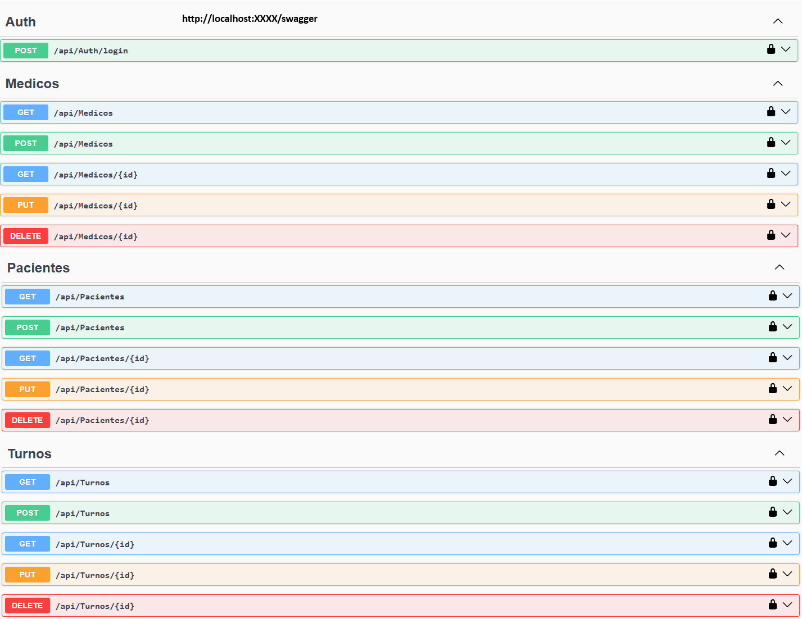
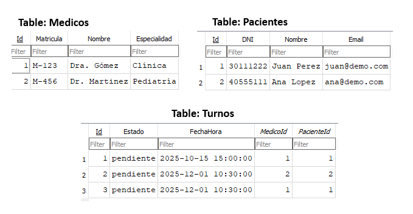
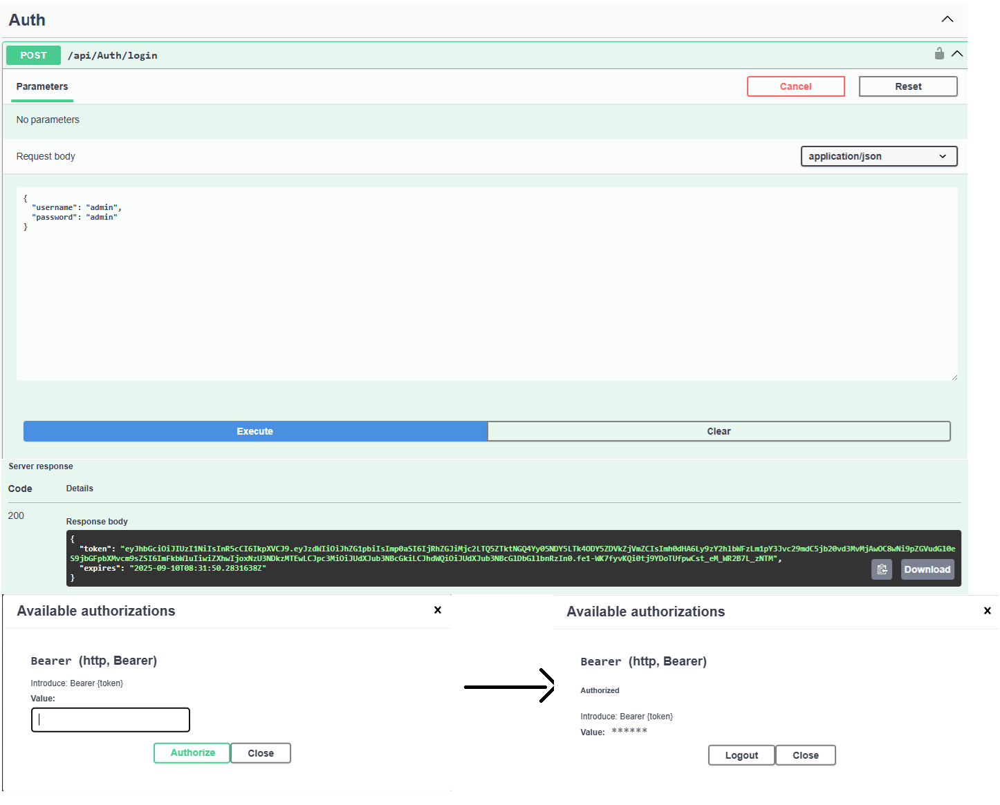

# TurnosApi (.NET 8 + EF Core + SQLite + JWT + Swagger)

API REST para gestión de **Pacientes**, **Médicos** y **Turnos**.  
Incluye CRUD completo, validaciones, autenticación **JWT** y documentación con **Swagger**.

---

## 👨‍💻 Autor
- **Máximo Estudillo**
- 📅 Proyecto desarrollado el **10 de septiembre de 2025**
- 🎯 Objetivo: practicar y demostrar conocimientos en **.NET 8** para mi portafolio.

---

## 🚀 Stack
- **.NET 8** (ASP.NET Core Web API)
- **Entity Framework Core 8** + **SQLite**
- **JWT** (Microsoft.AspNetCore.Authentication.JwtBearer)
- **Swagger / OpenAPI**

---

## 📦 Endpoints principales
- `GET /api/pacientes` → público
- `GET /api/pacientes/{id}` → público
- `POST /api/pacientes` → protegido con JWT
- `PUT /api/pacientes/{id}` → protegido con JWT
- `DELETE /api/pacientes/{id}` → protegido con JWT

> Idem para `medicos` y `turnos`.  
> En `turnos`, se valida que:
> - La fecha sea **futura**.  
> - El **estado** ∈ { `pendiente`, `confirmado`, `cancelado` }.  
> - Existan `PacienteId` y `MedicoId`.

---

## ▶️ Cómo correr localmente

1. **Clonar repo**
git clone https://github.com/maxidoe2/TurnosApi.git
cd turnos-api/TurnosApi

Restaurar paquetes y crear DB
dotnet restore
dotnet ef database update

Configurar JWT Key (solo dev)
dotnet user-secrets init
dotnet user-secrets set "Jwt:Key" "clave-secreta-dev-muy-larga"

Ejecutar
dotnet run
# o con hot reload
dotnet watch run
Abrir Swagger en: https://localhost:xxxx/swagger

🔐 Login de prueba (JWT) (Todos los GET no necesitan de autorización, solo los metodos POST, PUT Y DELETE)
Endpoint: POST /api/auth/login

Body:
{ "username": "admin", "password": "admin" }
Copiar el token devuelto → botón Authorize en Swagger → pegar Bearer {token}.

🗃️ Base de datos
EF Core con migraciones.

SQLite local: `Data Source=turnos.db`.

Seeds mínimos (Paciente #1, Médico #1, Turno #1).

## 🧰Scripts útiles

# Crear nueva migración
dotnet ef migrations add NombreMigracion
# Aplicar migraciones
dotnet ef database update
🛡️ Seguridad
Clave JWT manejada con user-secrets

En producción: usar DB gestionada (Postgres/SQL Server) y rotar la JWT Key.

## 📸 Screenshots

### Swagger con endpoints

### DB Browser mostrando tablas

### Proceso login/auth con Swagger

💡 Este proyecto me permitió:

Crear mi primera API en .NET 8 desde cero.

Usar Entity Framework Core con migraciones.

Manejar validaciones y unicidad en SQLite.

Implementar JWT Authentication en ASP.NET Core.

Documentar y probar con Swagger.
